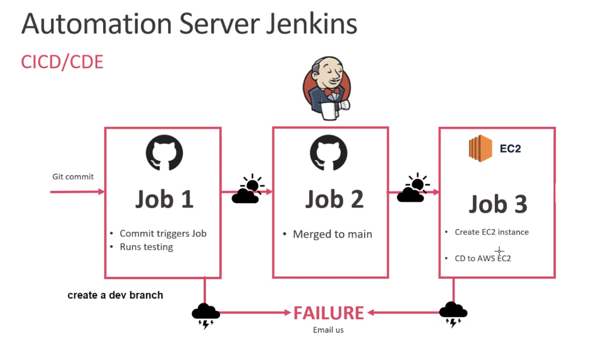
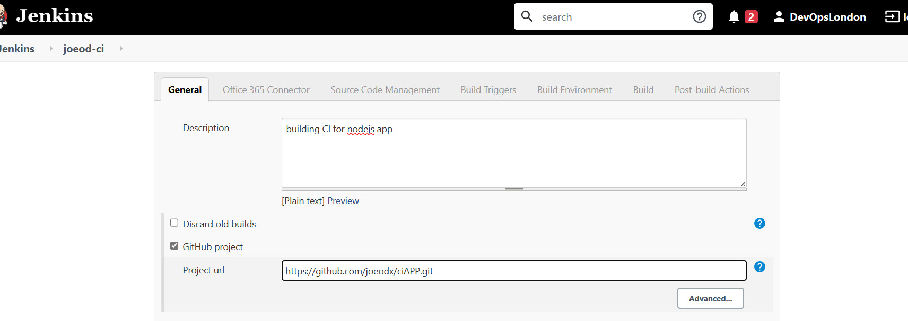
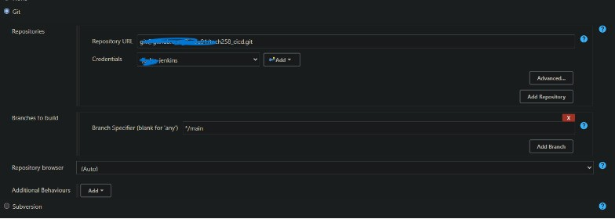
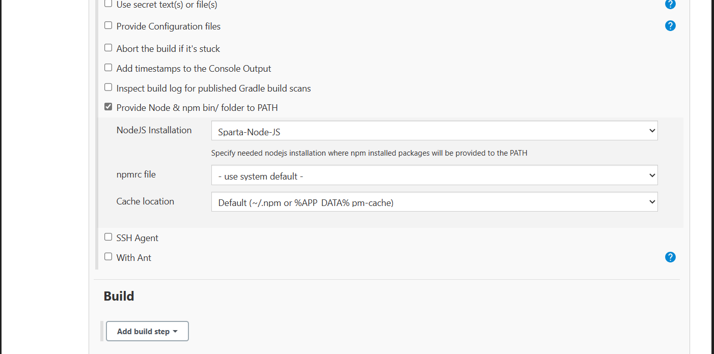
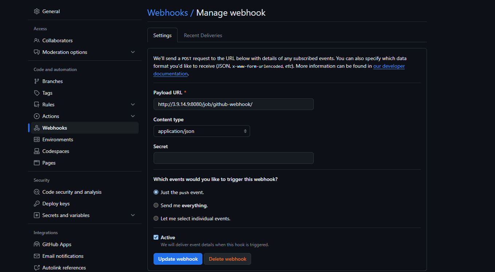

# Jenkins and Github 
*****************************

## Creating a CI/CD pipeline

What do we want to do?

* We want to create a simple pipeline for CI/CD
* We want to do this using a code from a github repo 
* We want to push our code to github in one branch 
* then automate the test merge and deploy


tHE FIRST TEST IS TO AUTOMATICALLY TEST OUR CODE AS SOON AS IT GETS PUSHED
THEN THIS WILL TRIGGER ANOTEHR JON THAT MRGES THIS CODE TO OUR MAIN BRANCH.


## Automation server with Jenkins 


 
 ## First of all what is a CI pipeline?

 * A Continuous Integration (CI) pipeline is a set of automated processes that software development teams use to build, test, and deploy their code changes. 
 * The primary goal of a CI pipeline is to automate the steps involved in integrating new code into a shared repository and ensuring that it functions correctly with the existing codebase.

 
## When is a CI pipeline used?
* CI pipelines are used whenever there are code changes to integrate into a project's codebase.
* Developers trigger CI pipelines by pushing code changes to a version control system (e.g., Git) or by creating pull requests.
* In our case looking at the diagram we are pushing the code automatically to jenkins to test the code before it is either deployed or delivered.

## How does a CI pipeline work?
* When triggered, a CI pipeline retrieves the latest code changes from the version control system and executes predefined stages or tasks
* Each stage in the pipeline performs a specific action, such as compiling code, running tests, checking code quality, or deploying artifacts.
* In our case the pipeline is being triggered when code needs to be teseted in Jenkins 
  
## Why use a CI pipeline?
* There are many uses to a Ci pipeline. It saves time as you can automate the process of thigns you can do manually 
* It ensures consistency along how code gets built, tested or even deployed 
  ********************************

## What is a web hook?

* A webhook is a mechanism for automatically triggering an action or notifying an external system when a certain event occurs.

* For example when you order something online, a webhook is the reason you get a confirmation email. 

***********************************
## What is a node?

* A node is an instance that is created for running our differnt builds.
* We can have a master node for production and maybe another node for testing.

# Creating our testing job (CI pipeline)


* The purpose of this job is to be created in jenkins that wil ltest our app that is in github
* It is using the main branch but can be used for any branch (see below on CD pipeline where this is changed to a dev branch)


Okay how do we complete job 1 which is testing the app works that was deployed....steps below!

1. Log into jenkins. 

2. Add a description to your project and then select the Github project checkbox and add your projects Url.
   For example mine was : 
```
git@github.com:Ziziou91/tech258_cicd.git
```



3. Go to the office 365 connector and click the option that says **Restrict where this project can be run**. Then under **label expression** add ```sparta-ubuntu-app```


4. On the **source managment tab** slect Git. Add the the github repo URL. You should have already have your SSH key set up so you should get a error message now. 

5. To fix this, add your private ssh key for the repo to Jenkins, and then choose it in the credentials. 

6. Also **change the branch to main** like below : 




7. Now we need to provide a Node and npm for our app. Under the build environment check Provide Node and npm bin? folder to Path.
  Change the node installation to ``Sparta-Node-JS```

8. When you go to build tab add this to the execute shell : 


```
cd
cd npm install
npm test 
```




9. Now save this. Our jenkins Master should be set up now.

10. Now head to your github repp and go to the setting called webhooks. You see an option callled called paylaod, make sure to enter the url for the jenkins serve like below : 

 * and the content type is **application/json**
 * click **jsut the push event**
 * click **Active**




Then click update webhook. The webhook will send a post HTTP request to our jenkins server. **200** if is correct and **404** if not

11. Now go back to the jenkins config page for our job and under the build triggets tab, make sure to check **Github hook triggers for GITScm polling. 

***************************************************


# CD pipelines with jenkins and GIThub
*************************************

* To make a Cd pipeline with jenkins, We are going to need to automate certain steps using triggers. This could be webhooks or from Jenkins builds being completed 
* We need to add the jobs to merge the code. 


How do we do that? The steps are below!


1. Create a dev branch on your github repo using ```git checkout - b dev```. 
2. You can do this in your git bash. 
3. Then  push that branch ```git push origin dev```

* We now want it to automatically merge this branch with the main branch so we need to set up a job to do that. 


## Job 1 
****************
1. Create a job on jenkins to test the push on the dev branch.
2. When something gets pushed a a job gets triggered to test teh code 
3. 3. Set it up like the job you did before but 


## Merge code from development branch to main branch
* Configure Jenkisn to use your Git repo and chosoe the dev branch you have created 
* Scroll down to the ```post-build-action``` and click on ```add post-build action```
   * select "Git Publisher"
   * Check t
1. For testing purposes, make a change to your work. 

2.  Now using the testing job we created before, if the test pass it shall trigger the next job to merge the code from your new branch you created to ```main```
   
  


## Continus Delivery with Jenkins 

* Now our code has been tested and has merged to the ```main branch``, the next step is to copy that code over to production
* In our case that will be a ec2 instance. 

How do we do this?

1. Create a EC2 instance on AWS- with **Ubuntu 18.04 LTS**
2. Configure the network security group to allow *ssh*,**3000**(node app) and 8080(for jenkins) and **80** for HTTP traffic
3. git clone the app coide to the EC2 instance we made.
4. Install what dependencies are required.

* Once this is done we can now ssh into the instancew we made and manually install and start the app

## Continious Deployment with Jenkins 

How do we get our code to automatically deployed to the cloud?

1. Use jenkins to ssh into our EC2 without user input so add the ```frontend command```
2. Head to the app folder.
3. Start the app in the background!

***************************************************************


